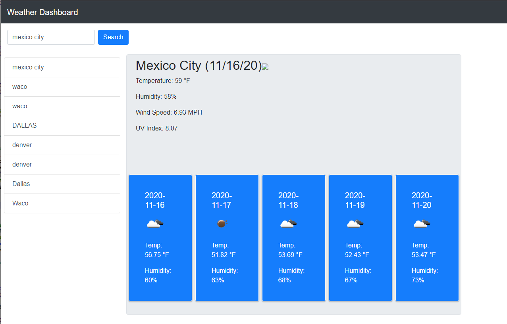

# 06-Homework assignment - Weather API Dashboard

- Repository link: https://github.com/robertsantos-dfw/06-Homework
- Web app link: https://robertsantos-dfw.github.io/06-Homework/

# Project Description

The objective to this homework assignment is to use an api, store searched data in storage, and create dynamic div/containers with api data for 5 days using for loop.

# Project

With the help Bootstrap cards and forms, I was able to put together a weather app that contained a jumbotron of Today's weather info. Also, cards to display a five day forecast. 

# Screenshots

# Technologies used, API's used

- Open weather api (https://openweathermap.org/api)
- Bootstrap
- jQuery

